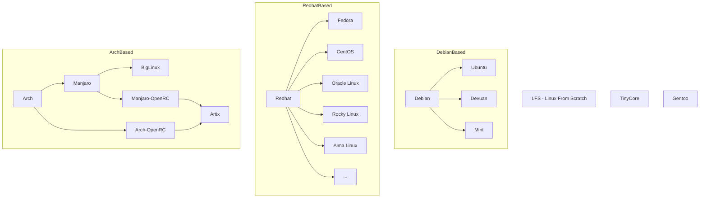

# Distributions

[distrowatch](https://distrowatch.com/)

```mermaid
graph TB
  LFS[LFS - Linux From Scratch]
  TinyCore
  Gentoo
  subgraph DebianBased
    direction LR
    Debian --> Ubuntu
    Debian --> Devuan
    Debian --> Mint
    end
  subgraph RedhatBased
    Redhat --> Fedora
    Redhat --> CentOS
    Redhat --> B[Oracle Linux]
    Redhat --> C[Rocky Linux]
    Redhat --> D[Alma Linux]
    Redhat --> ...
    end
  subgraph ArchBased
    Arch --> Manjaro
    Manjaro --> BigLinux
    Manjaro --> Manjaro-OpenRC
    Arch --> Arch-OpenRC
    Manjaro-OpenRC --> Artix
    Arch-OpenRC --> Artix
    end
```

https://www.makeuseof.com/smallest-fastest-linux-distro-works-for-everyday-stuff/
